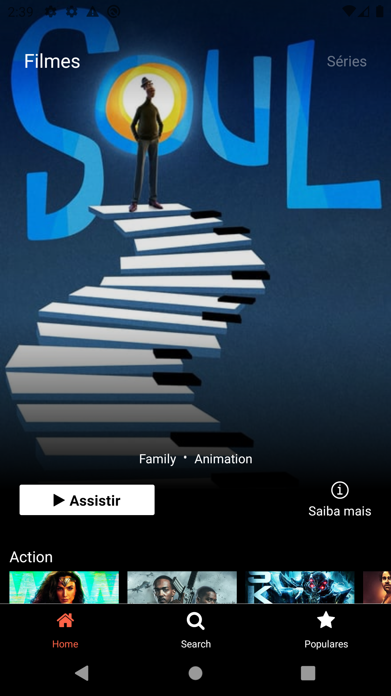
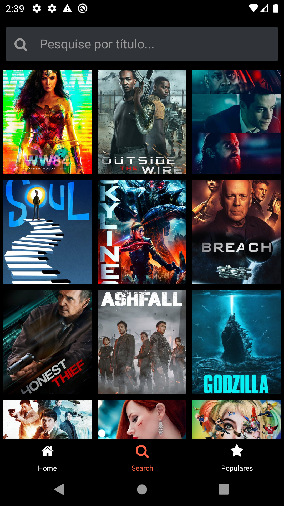
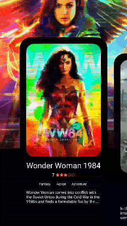

<h1 align="center">
 
Movies React Native
</h1>

Movies and series application. With this app you can search for movies and series and see where to watch them. In addition you can access the list of the most popular films of the moment.

  

# Images

  
  
  

  
  
  

  
  
  

## API

This project uses [The Movie DB API](https://developers.themoviedb.org/3/getting-started/introduction)

## Techs and Libs

- ⚛️ **React Native** — A lib that provides a way to create native apps for Android and iOS
- Typescript
- Eslint + Prettier + Editorconfig (code patterns)
- Animations with Animated
- Styled Components
- React Navigation (tabs and stack)
- SWR
- Context API
- React Hooks

## Features

- User can see movies and tv shows by categorie
- User can search a movie or tv show by title
- User can see where watch movie or tv show
- User can see movie and tv show details like title, description, release data and rating
- User can see top 10 most popular tv shows and series

## Getting started

- Clone project > enter the project folder
- Update src > env.example.js with correct values
- run `yarn`
- run `yarn android`
- change src/config/api.ts putting your API_KEY

## License

This project is licensed under the MIT License - see the [LICENSE](https://opensource.org/licenses/MIT) page for details.

---

Created with passion by me 👨🏻‍💻
